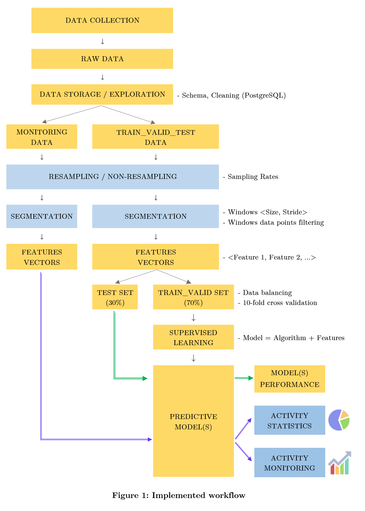
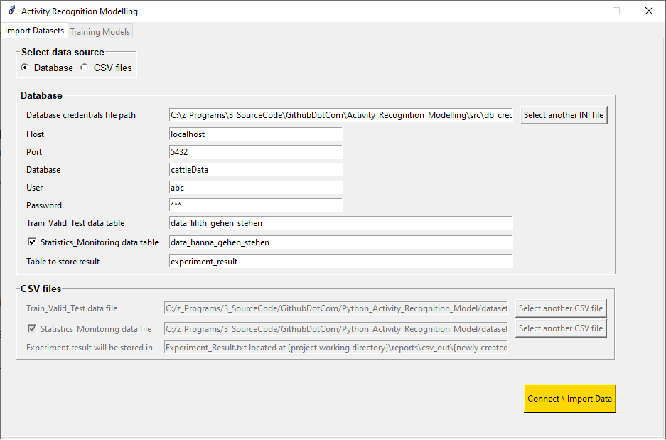
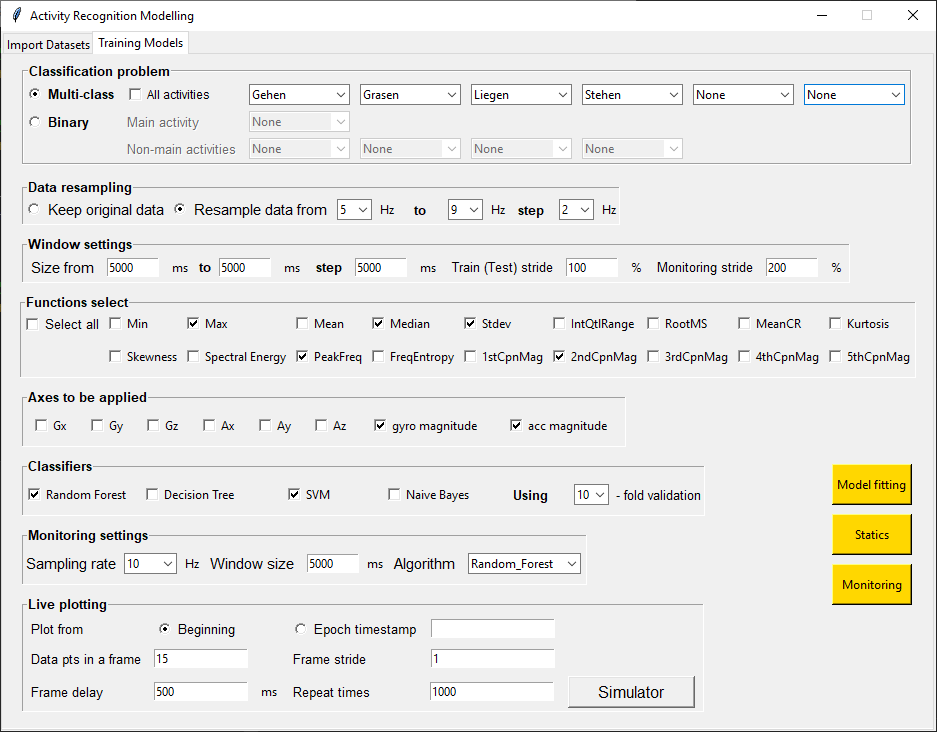
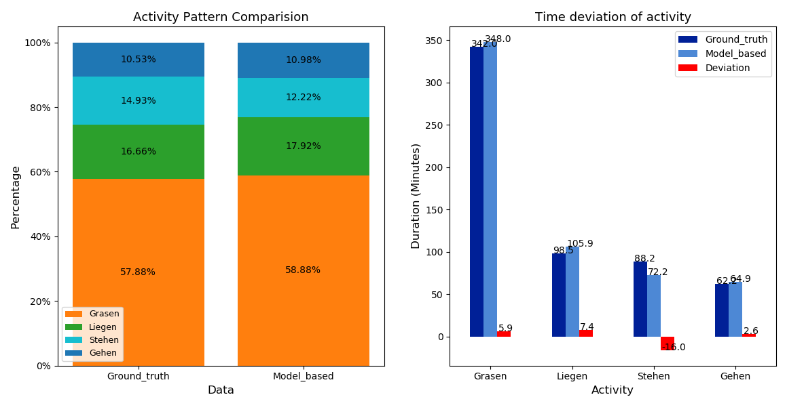
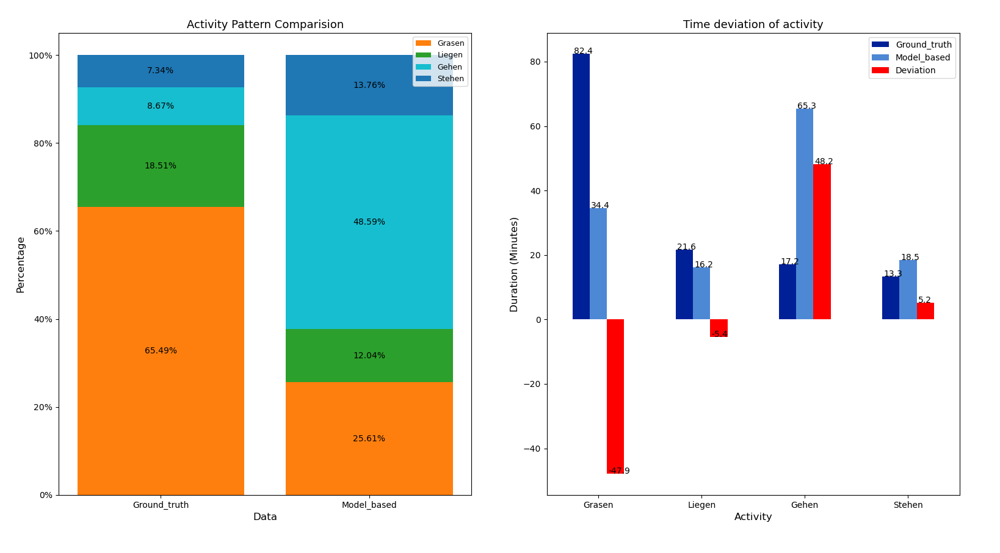
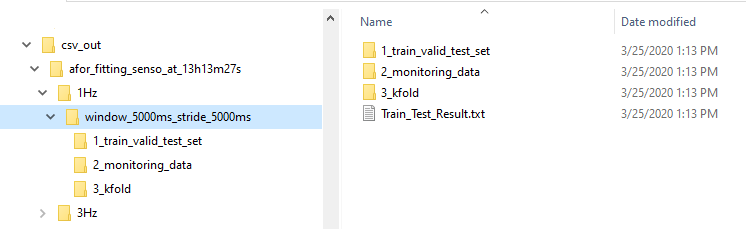

# Activity Recognition Modelling
## 1. Project Description
### A. Introduction  
* The Python GUI is about building and evaluating [Activity Recognition](https://en.wikipedia.org/wiki/Activity_recognition/) Models from triaxial inertial sensors data carried by objects (cattle in this case). The project, however, can be used to build models in recognizing human activities, too.   
* This is developed as the programming part for fulfilling the thesis *“Evaluating the Impact of Sampling on Activity Monitoring in Dairy Cattle”* in [MSc. Software Systems Science program](https://www.uni-bamberg.de/ma-isosysc/) at the [Chair of Mobile Systems](https://www.uni-bamberg.de/mobi/) - the University of Bamberg  
* This is also a technical part of the FutureIoT/Rindertracking project - https://www.futureiot.de/portfolio/rindertracking/  
* **Publication**: L. Schmeling, G. Elmamooz, P. T. Hoang, A. Kozar, D. Nicklas, M. Suenkel, S. Thurner, and E. Rauch (2020). *Sensor-based Monitoring of Lying Behaviour in Dairy Cows on Pasture*. Computers and Electronics in Agriculture (**in revision**).  

### B. Problem Context
* Most activity tracking apps installed on wearable devices are relying on sensor data for the purpose of correctly predicting the carrier's activity. The common problem of these devices is the short battery duration, which is mainly due to the high frequency of sensor data updates and computing expense. Practically, there is a trade-off between the prediction accuracy and the high computing and frequency of data update, not to mention data redundancy.  
* This project is to find the answer to the question of how often and how much data a model should consume while remaining significant accuracy in predicting a particular set of cattle activities. This is more specifically to find the most contributing sensor axes and at what sampling rate, and how large a window of sampled data should be used.  

### C. Development Language and running Environment
* The project is developed with Python 3.8 (64 bit), and **WindowOS** is the recommended running environment.  The GUI is distorted on MacOS as the tkinter library is not well supported by the system. The author is planning to convert this project into the web version.

### D. The project workflow
After researching the previous studies, the workflow is implemented as shown below

  

### E. Input data source
* The sensor data come from the Bosch BNO055 device which contains inertial sensors originally sampled at 10Hz.   
* The application supports data importing from either database or csv files. The DBMS supported in the project is PostgreSQL version 9.5.17.  
* The two input data tables/csv files called **Train_Valid_Test** and **Monitoring** must contain at least 9 columns (i.e., cattle_id, label, gx, gy, gz, ax, ay, az, timestamp) with the data types are as follow:

| Column name  | Data type | Explanation |
| ------------- | ------------- | ------------- |
| cattle_id | text | ID number of the cow (e.g., DE1234)  |
| label | text | Labelled activity of cows (e.g., Liegen)  |
| gx | double precision | Gyroscope x axis signal value  |
| gy | double precision | Gyroscope y axis signal value  |
| gz | double precision | Gyroscope z axis signal value  |
| ax | double precision | Accelerometer x axis signal value  |
| ay | double precision | Accelerometer y axis signal value  |
| az | double precision | Accelerometer z axis signal value  |
| timestamp | bigint | Timestamp in Unix Epoch time format  |

With these initiatives, it is possible to train a model from mixed data of multiple cattles by storing sensor data of difference cattles in the **Train_Valid_Test** table (distinguished by **cattle_id**)  

### F. Repository Structure
| Folder/File | Purpose |
| ------------- | ------------- |
| csv_out | Folder containing csv output files / experiment result for each run |
| src | Main source code |
| src /db_credentials.ini | A template storing credentials and input tables/csv files for input data importing |
| datasets | Folder contain sample input datasets for some cattle |

## 2. Step-by-step running
### A. Data importing  
#### - The database importing mode

  

* **Database credentials file path** section stores the path to the ini file that contains the database credentials (e.g., the template is the file **db_credentials.ini** mentioned above).  
* **Host, Port, Database, User, Password** stores database connection and user credentials which are loaded (updated) from (to) ini file in Database credentials file path section.
* **Train_Valid_Test table** stores the name of db table which is used for the train/valid and test phrase. This table structure meets the requirements in Table in 1.E.
* **Statistics_Monitoring table** stores the name of db table which is used for the Statistics/Monitoring phrase. This table structure meets the requirements in Table in section 1.E. **If the checkbox is unchecked, then it only runs training/validation and testing phrase**
* **Table to store result** stores the result for each experiment, it is automatically created if not exists on the database system. Every derived model will be saved into this table as a new record. The structure of this table is described in Structure of the result table.

#### - The csv files importing mode
This is for those who don’t bother to set up a PostgreSQL database. The two csv files **Train_Valid_Test** and **Statistics_Monitoring** serve the same functions as the two database tables mentioned previously.

### B. Model training screen  

  

* **Classification problem**: The application supports building two types of problem, e.i. multi-class and binary classification. For binary classification, the application supports building model which classifies one main label (e.g. **Liegen**) against some other **Non-main labels (Gehen, Grasen, Stehen)**. In this case, the labelled training samples will be distributed at a **3:1:1:1** proportion  

* **Data resampling**: User can either choose **Keep original data** to **resample the data** with sampling rates in given range.  

* **Window settings**: With the setting like in the 2.B. Model training screen, it will run with the window sizes of 5, 7 and 9 seconds.  The **Train (Test) stride** is set to 100% meaning all data in **Train_Valid_Test table** will be used for Train/Valid and Test phrase. The **Monitoring stride** option is set to 200% meaning only half of data in **Statistics_Monitoring table** will be used for Statistics/Monitoring metrics calculations.  

* **Functions Select** and **Select axes to be applied** help to choose features for the classifier(s) selected in the Classifiers section underneath. The number of features = number of functions * number of axes.  

* After selecting **classifier(s)** and **Kfold** option, just click **Model fitting** button for running **Train_Valid_Test** phrase, the result will display in console, log into *“Experiment_Result.txt”* file in **csv_out** folder and update to Database (in casee the database import mode is selected).  

* **Monitoring setting**: After fitting the model, user can view the Statistics and Monitoring metrics with the two buttons Statistics and Monitoring. These two buttons will be disabled if the checkbox in the Figure in 2.A. data import is unchecked.  

Because the statistics and monitoring metrics are generated under each classifier at a specific sampling rate and window size, user needs to choose these three options in the **Monitoring setting** section. It is **important** to select these options that fall into one combination of sampling rates and window sizes (types) selected previously.  

To be more clearly, settings in 2,B. Model training screen enables user to train the model with sampling rates of 1, 3, 5, 7, 9 (Hz) in combination with window sizes of 5, 7, 9 (seconds) under 4 classifiers (5 * 3 * 4 = 60 combinations). As a result, in the **Monitoring setting** section, if user selects **Sampling rate** of 10Hz (which is not in the 60 combinations) then it does not show the statistics/monitoring metrics.  

## 3. Statics helps to visualize “The Good" and "The Bad” models
### A. The Good

  

  

### B. The Bad

  

  

### C. The Ugly {bug}
... is missing  

## 4. Other important notes
### A. How to train/valid/test on multiple (mixed) cows’ data and testing on another unseen cows?
To train on cow 1,2,3 and test on cow 4, just create the **Train_Valid_Test table** containing data from cow 1,2,3 then create the **Statistics_Monitoring table** containing sensor data of cow 4. The structure of these tables must meet the requirements in 1.E. The result will be shown in console, updated into database (if selected) and logged into “Experiment_Result.txt” file located in **csv_out** folder as described in 1.F.  

### B. CSV log files

  

  
 
With a specific sampling rate and window size (type), the text file “Experiment_Result.txt” will be created to store the experiment results for that configuration. This .txt file is created in a sub folder of **csv_out** folder as shown in the Figure below. This sub folder is created in every run (every click on **Model fitting** button).
Additionally, for each configuration (e.g., sampling rate, window size/stride) the data set regarding train_valid_test and monitoring can be logged into .csv file for checking of correctness in features calculation. To enable .csv files saving, in the app.ini file/section **[GLOBAL SETTINGS]**, just set the variable **csvsaving** to 1 (Or csvsaving = 1).

## 5. The experiment result table on database
In the case user select importing data from database, the result of the experiment will be updated to the **Table to store result** given in section 2.A.  
The structure of this table is as follow:  

| Column name  | Data type | Explanation |
| ------------- | ------------- | ------------- |
| model_title | text | This column is created for the purpose of showing the model to the end-user. The default value is an empty string, when it is given a string then it will be shown to the end-user. |
| model_init_name | text | The initialised name of the model, after a model is trained then its name is set at the default format: [date_of_creation] _[hhmmss]_username_[Binary/Multi]_[name_of_algorithm]  An example is “20200520_005954_thaihp_Binary_RandomForest” |
| model_binary_content | bytea | The content of the model in binary format |
| model_comments | text | User comments of the model |
| train_table | text | The name of table for training |
| monitor_table | text | Table for the Staticstic_Monitoring metrics |
| no_of_predicted_classes | integer | Number of classes to be classified |
| list_of_predicted_classes | text | List of classes to be classified |
| original_sample_rate_in_hz | integer | The original sampling rate of the training data (train_table) |
| no_of_original_train_data_points | integer | Number of data points in the train_table |
| resampled_rate_in_hz | integer | resampling rate (if user chooses resample data in Figure 3 of readme.pdf file) |
| no_of_resampled_train_data_points | integer | The number of data points of training data after resampling |
| no_of_instances_for_each_class_in_resampled_train_table | integer | Number of instances for each class in the (resampled) training data |
| algorithm | text | The classifier selected |
| no_of_functions | integer | Number of functions |
| list_of_functions | text | List of functions |
| no_of_axes | integer | Number of axes selected for the training |
| list_of_axes | text | List of axes selected for the training |
| window_size | integer | The window size (in milliseconds) in of training/monitoring phrase  |
| window_stride | text | The window stride for training phrase only |
| k_fold | integer | K fold |
| accuracy_train_valid | real | Accuracy of train_valid phrase |
| precision_train_valid | real | Precision of train_valid phrase |
| recall_train_valid | real | Recall of train_valid phrase |
| specificity_train_valid | real | Specificity of train_valid phrase |
| f1_train_valid | real | F1 score of train_valid phrase |
| accuracy_test | real | Accuracy on Test set (30% of the training data) |
| precision_test | real | Precision on Test set |
| recall_test | real | Recall on Test set |
| specificity_test | real | Specificity of Test set |
| f1_test | real | F1 score of Test set |
| monitoring_window_stride | text | The window stride for monitoring phrase |
| accuracy_monitor | real | Accuracy on Monitoring data |
| precision_monitor | real | Precision on Monitoring data |
| recall_monitor | real | Recall on Monitoring data |
| specificity_monitor | real | Specificity on Monitoring data |
| f1_monitor | real | F1 score on Monitoring data |
| start_time | timestamp | Starting time of the run |
| end_time | timestamp | Ending time of the run |
| running_time_in_minutes | text | The duration of the experiment |
